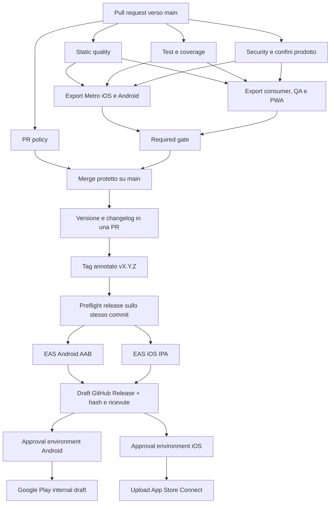

# CI/CD di produzione

Stato: configurazione locale del 15 settembre 2026. La pipeline e i suoi
validatori sono presenti nel repository; ruleset, environment, segreti e run
GitHub/EAS restano da configurare sul remoto prima di considerarli operativi.

## Obiettivo e confine

[F] GitHub Actions orchestra integrazione e release. EAS esegue le build native
firmate e l'invio agli store. Il repository controlla versione, build number,
dipendenze, profili, changelog e manifest; le credenziali restano nei servizi
gestiti e non entrano negli artefatti o nei log pubblici.

[F] Nessuna build cloud, submission, pubblicazione, tag, push o modifica remota
è stata eseguita per introdurre questa architettura. Finché i workflow non sono
nel branch remoto e le protezioni indicate sotto non sono attive, l'obbligo
prima del merge è `NON DETERMINATO — EVIDENZA INSUFFICIENTE`.

[F] Il controllo remoto read-only del 15 settembre 2026 vede il repository
pubblico `robertfultonstudio/App-Relax` senza branch o default branch. Il primo
push dovrà quindi pubblicare un baseline completo e verificato prima che sia
possibile rendere obbligatorio `CI / Required gate`.

## Architettura e ordine dei gate



I primi tre job sono indipendenti e vengono eseguiti in parallelo. Gli export
partono solo se tutti e tre sono verdi; il job `Required gate` fallisce se un
qualsiasi risultato precedente è fallito, annullato o saltato.

### 1. Static quality

- installazione con Node `22.23.1`, pnpm `11.16.0` e lockfile congelato;
- Prettier ratchet;
- ESLint ratchet sull'intero corpus;
- TypeScript strict senza emissione;
- controllo peer dependencies; l'unica compatibilità esplicita è TypeScript
  `6.0.3`, già compilata e verificata da Expo Doctor, per il peer Expo ancora
  dichiarato sulla major 5;
- validazione di configurazione Expo/EAS;
- validazione strutturale dei workflow, incluse permission esplicite, timeout e
  action di terze parti fissate a SHA completa.

Il ratchet salva il debito ammesso in `quality/ratchet-baseline.json`. Ogni
violazione ESLint è identificata da percorso, regola e messaggio normalizzato:
spostare una riga non la trasforma in debito nuovo. Una pull request fallisce
per ogni nuova violazione o file non formattato. Le correzioni sono mostrate nel
report e il baseline può essere aggiornato solo in senso monotono; lo script
rifiuta un aumento del debito. Il baseline attuale è ESLint `0`, Prettier `1`
(un documento storico), quindi nessun nuovo problema di lint è consentito.

### 2. Test e coverage

- tutte le suite Jest in seriale con timeout esplicito;
- coverage statements, branches, functions e lines;
- coverage ratchet: nessuna metrica può scendere oltre la tolleranza di
  arrotondamento di `0,01` punti;
- test Node dedicati a validator, ratchet e strumenti di release.

Il baseline corrente è statements `79,03%`, branches `74,29%`, functions
`76,14%`, lines `81,35%`. Un miglioramento può essere acquisito con
`pnpm coverage:ratchet:update`; il comando non può abbassare il valore già
registrato.

### 3. Security e confini del prodotto

- audit dipendenze fail-closed secondo la policy del repository;
- audit separato della toolchain EAS: zero high/critical e allowlist esatta dei
  tre residui low/moderate; advisory nuovo o forma/percorso mutato falliscono;
- scansione di file tracked e nuovi non ignorati per nomi credenziale, chiavi
  private e token riconoscibili;
- validazione asset, opere e AUDIO TEST PACK 01;
- assenza del Workbench nella superficie consumer;
- permessi Android ammessi;
- risoluzione reale dei profili EAS Android/iOS mediante la CLI fissata, con
  confronto di versione, build number, distribution, builder e public root;
- generazione locale dello stesso archivio che EAS caricherebbe e verifica di
  dimensione, symlink, segreti, percorsi locali e perimetro audio.

L'archivio usa `EAS_NO_VCS=1`: in questo progetto è il percorso già validato che
fa rispettare `.easignore` ed evita di includere metadata Git. Il catalogo
locale, la PWA privata, le route QA, test, script, documentazione, output
paralleli e credenziali restano fuori.

### 4. Export e packaging

- export Metro consumer separati per iOS e Android;
- verifica che nessun catalogo localhost o route tecnica entri nei bundle;
- export Web consumer, QA e PWA in directory distinte;
- verifica delle sentinelle QA e del contratto PWA;
- manifest JSON per ogni gruppo di artefatti, con SHA-256, byte, commit, epoch
  del commit, versione app, build number, runtime e stato del worktree.

I manifest di CI/release richiedono inoltre un worktree sorgente pulito; un
file generato o una mutazione inattesa interrompono il job.

Questi export verificano bundle JavaScript e confini di packaging. Non
compilano né certificano il codice nativo e non sostituiscono il test su
telefono reale.

## Controlli obbligatori sul remoto

Configurare un ruleset per `main` con:

1. pull request obbligatoria e almeno una review;
2. revoca delle review dopo nuovi commit e conversazioni risolte;
3. branch aggiornato prima del merge;
4. status check obbligatori `PR policy / Policy gate` e `CI / Required gate`;
5. Code Owner review per workflow, quality gate, release e configurazione;
6. blocco di force-push, cancellazione e push diretto, salvo account di
   emergenza auditato;
7. tag `v*.*.*` protetti e creabili solo dal responsabile release.

Sul repository pubblico abilitare anche GitHub secret scanning e push
protection: il controllo locale riduce gli errori comuni, mentre il servizio
remoto controlla storia e pattern aggiornati.

Creare quattro GitHub Environments con reviewer obbligatorio:

- `eas-production-android` e `eas-production-ios` prima di consumare una build
  EAS firmata;
- `store-android` e `store-ios` prima di ogni submission.

`EXPO_TOKEN` deve essere limitato agli environment di build/submission. Le
credenziali Apple e Google restano in EAS o nei rispettivi store, con privilegi
minimi. Dependabot controlla settimanalmente npm e GitHub Actions; ogni update
attraversa gli stessi gate.

Naming, scope delle PR, strategia branch e worktree sono definiti in
[`GIT_WORKFLOW.md`](GIT_WORKFLOW.md). Il gate PR blocca naming o descrizione
incompleti e richiede l'approvazione esplicita di un maintainer oltre 1.200
righe o 35 file revisionabili; il target ordinario resta molto più piccolo.

## Versioni, tag e changelog

[F] La versione pubblica segue SemVer stabile `MAJOR.MINOR.PATCH` e deve
coincidere in `package.json` e `app.json`. Android `versionCode` e iOS
`buildNumber` sono interi monotoni, controllati dal repository e incrementati a
ogni release anche se la versione marketing cambia solo di patch.

Flusso locale equivalente:

```bash
pnpm release:prepare 1.1.0
pnpm release:check
# review e merge della PR di release
git tag -a v1.1.0 -m "App Relax 1.1.0"
git push origin v1.1.0
```

Il workflow manuale `Prepare release` riceve la versione SemVer, esegue lo
stesso aggiornamento, valida metadata e tooling, crea il branch
`release/vX.Y.Z` e apre una pull request. Non crea il tag e non bypassa review o
CI. Per usarlo, GitHub deve consentire al token Actions di creare pull request.

`release:prepare` accetta solo una versione superiore, richiede una sezione
Unreleased non vuota, aggiorna entrambe le versioni native e sposta le note
nella sezione datata. Il tag deve essere annotato e corrispondere esattamente
alla versione. Il workflow accetta solo un commit già incluso in `main` con una
CI verde per lo stesso SHA.

Il changelog usa Keep a Changelog:

- `PATCH`: correzioni compatibili;
- `MINOR`: nuove funzioni compatibili;
- `MAJOR`: cambi incompatibili a dati, API o comportamento pubblico.

## Release, tracciabilità e riproducibilità

Il push del tag crea due build EAS distinte. Il workflow attende `FINISHED`,
scarica AAB/IPA solo via HTTPS e produce:

- artefatto nativo firmato;
- ricevuta pubblica con EAS build ID, piattaforma, versione, build number,
  commit e fingerprint quando forniti;
- manifest SHA-256;
- archivio sorgente deterministico da `git archive` e `gzip -n`;
- `SHA256SUMS` e note estratte dal changelog;
- GitHub Release inizialmente in stato draft.

Dipendenze, Node, pnpm, EAS CLI `24.3.0` e immagini builder sono fissati. La CLI
EAS viene eseguita come tool isolato: Expo Doctor vieta di aggiungerla alle
dipendenze dell'app e l'audit non deve ereditare il suo grafo di toolchain.
L'archivio sorgente e gli export JS sono rigenerabili dallo stesso commit. AAB e IPA
firmati non sono dichiarati byte-per-byte riproducibili: firma, timestamp e
toolchain remota possono cambiare. Build ID, fingerprint, commit, configurazione
e hash rendono ogni binario identificabile e verificabile.

La release non pubblica automaticamente agli utenti finali. Dopo i reviewer
GitHub, Android entra nella track `internal` come draft e iOS viene caricato in
App Store Connect. Device test, ascolto, metadata/diritti e revisione store
restano gate umani prima della promozione pubblica.

## Rollback

- Prima della submission: annullare il job o negare l'environment; il draft
  resta un'evidenza, non una release distribuita.
- Track interna/TestFlight: arrestare la promozione e riattivare per i tester
  la build precedente disponibile nello store.
- Dopo una release pubblica: creare un hotfix dal tag sano, applicare la
  correzione e pubblicare una **nuova** versione con build number maggiore. Gli
  store non consentono di sovrascrivere il binario già distribuito.
- PWA/statico: ridistribuire l'artefatto verificato precedente e conservare il
  manifest/hash del rollback.
- Dati: oggi non esiste una migrazione backend da ripristinare. Quando verrà
  introdotta, ogni deploy dati dovrà essere backward-compatible e avere backup
  e procedura di restore provata prima della release.

Non cancellare o spostare un tag pubblicato. Se un tag è errato prima della
distribuzione, marcare la release come ritirata e creare una nuova versione.

## Costi della pipeline

Il piano EAS Free pubblicato include fino a 15 build Android, 15 iOS e 60
minuti di Workflows; Starter costa $19/mese più uso e Production $199/mese più
uso. Questa implementazione usa GitHub Actions per la CI e consuma EAS solo sui
tag di release, dopo l'approvazione degli environment. Il costo effettivo di
GitHub Actions, environment protetti e build EAS dipende dai piani/account
remoti: `NON DETERMINATO — EVIDENZA INSUFFICIENTE` fino al preflight live.
Ricontrollare sempre [il listino EAS](https://expo.dev/pricing) prima di una
build autorizzata.

## Comandi locali

```bash
pnpm ci:static
pnpm ci:test
pnpm ci:security
pnpm ci:mobile-exports
pnpm ci:web-exports
pnpm ci:required
pnpm release:check
```

Riferimenti operativi: [GitHub Actions CI](../.github/workflows/ci.yml),
[release](../.github/workflows/release.yml), [configurazione EAS](../eas.json),
[baseline ratchet](../quality/ratchet-baseline.json) e
[changelog](../CHANGELOG.md).
